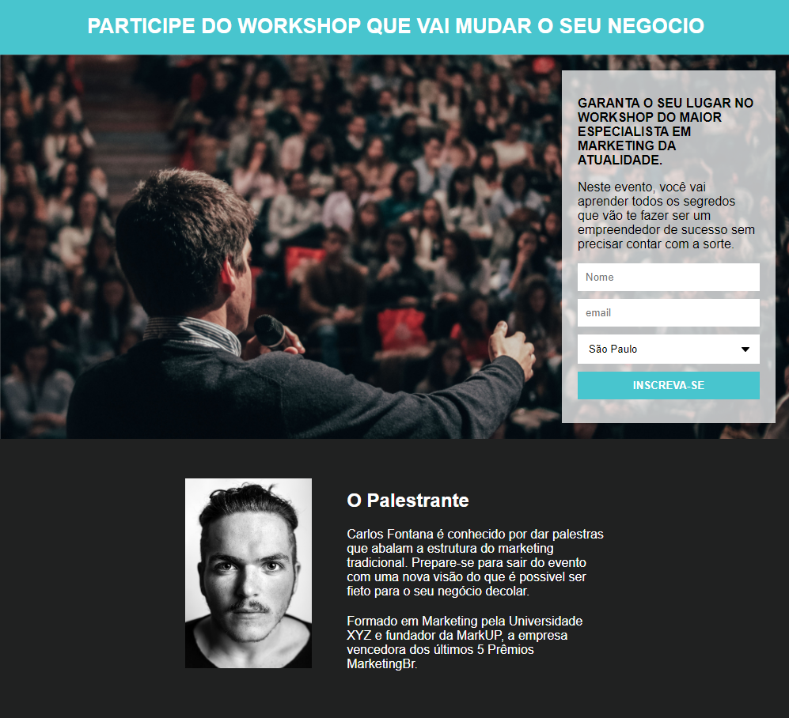

# Página de captura. 

 

### Usabilidade
>Com uma pagina de captura, os usuários podem se inscrever para receber informações pertinentes ao seu serviço ou produto, por exemplo, palestras, venda de produtos. Então, é criada uma lista de contatos onde podemos enviar e-mails simultaneamente para todos os usuários interessados. 
 

### Tecnologias utilizadas. 
HTML5 
CSS 
Integração com a ferramenta Mailchimp para gerenciar a lista de contatos.
https://mailchimp.com/
   

_Projeto criado para fins educacionais._ 
Curso: CURSO DESENVOLVIMENTO WEB FULL STACK 
Professor: Igor Oliveira.  
https://programadorbr.com/ 

